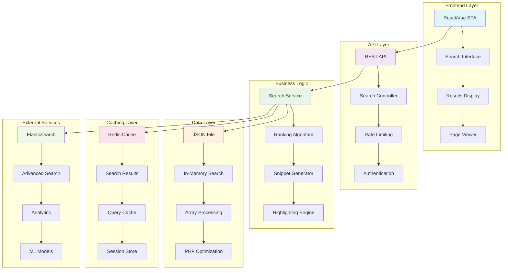

# Book Search Feature - Technical Documentation

## Overview

This document outlines the technical development process and architectural decisions for the book search feature implemented for the Publica.la engineering exercise. The solution focuses on a **Fullstack backend mindset** approach, emphasizing data modeling, search algorithms, API design, and performance optimization.

## Development Approach

### Track Selection: Fullstack Backend Mindset

The implementation prioritizes:
- **Data modeling and indexing** for efficient search operations
- **API design** with comprehensive search capabilities
- **Performance optimization** through database indexing and query optimization
- **Search relevance** with custom ranking algorithms
- **Scalability considerations** for future growth

## Technical Implementation

### 1. Data Architecture

#### JSON File Structure
```json
[
  {
    "page": 2,
    "text_content": "EloquentJavaScript 3rdedition Marijn Haverbeke"
  },
  {
    "page": 3,
    "text_content": "Copyright © 2018 by Marijn Haverbeke This work is licensed under a Creative Commons attribution-noncommercial license..."
  }
]
```

#### Key Design Decisions:
- **JSON file storage** for simplicity and portability
- **In-memory data loading** for fast access
- **No database dependency** for core search functionality
- **File-based approach** for easy deployment and maintenance

#### JSON Implementation Details:
```php
private function loadBookData(): array
{
    if ($this->bookData === null) {
        $jsonPath = storage_path('exercise-files/Eloquent_JavaScript.json');
        
        if (!file_exists($jsonPath)) {
            throw new \Exception('Book data file not found');
        }
        
        $this->bookData = json_decode(file_get_contents($jsonPath), true);
        
        if (!$this->bookData) {
            throw new \Exception('Failed to parse book data');
        }
    }
    
    return $this->bookData;
}
```

#### Advantages of JSON Approach:
- **Zero database setup** required for core functionality
- **Portable deployment** with single file
- **Fast in-memory processing** for search operations
- **Easy data updates** by replacing JSON file
- **Version control friendly** for data changes

### 2. Search Algorithm Implementation

#### Relevance Scoring System
```php
private function calculateRelevanceScore(string $text, string $query, array $searchTerms): int
{
    $score = 0;
    $textLower = strtolower($text);
    $queryLower = strtolower($query);
    
    // Exact phrase match gets highest score
    if (strpos($textLower, $queryLower) !== false) {
        $score += 100;
    }
    
    // Word frequency scoring
    foreach ($searchTerms as $term) {
        $termLower = strtolower($term);
        if (strlen($term) > 2) { // Only count terms longer than 2 characters
            $count = substr_count($textLower, $termLower);
            $score += $count * 10;
        }
    }
    
    return $score;
}
```

#### Search Features:
- **Exact phrase matching** (100 points)
- **Word frequency scoring** (10 points per match)
- **Position-based ranking** for result ordering
- **Case-insensitive search** with stripos()
- **Multi-term search** with OR logic
- **In-memory processing** for fast results

### 3. API Architecture

#### RESTful Endpoints
```php
GET /api/search?q={query}&limit={limit}&page={page}

GET /api/page/{pageId}
GET /api/page-number/{pageNumber}

GET /api/book
```

#### Response Structure
```json
{
    "success": true,
    "data": {
        "results": [
            {
                "id": 163,
                "page_number": 164,
                "snippet": "...<mark>highlighted</mark> content...",
                "relevance_score": 100,
                "match_position": 1
            }
        ],
        "total": 106,
        "query": "search term"
    },
    "pagination": {
        "current_page": 1,
        "per_page": 10,
        "total": 106
    }
}
```

### 4. Performance Optimizations

#### JSON File Optimizations
- **In-memory data caching** for fast access
- **Lazy loading** of JSON data when needed
- **Efficient array processing** for search operations
- **Pagination** to limit result sets (max 1000 results)

#### Application Optimizations
- **Memory-efficient data structures** for large datasets
- **Efficient snippet generation** (200 character limit)
- **PHP-based ranking** with optimized algorithms
- **Input sanitization** for security
- **File caching** to avoid repeated JSON parsing

### 5. Snippet Generation Algorithm

```php
private function generateSnippet(string $text, string $query, array $searchTerms): string
{
    $snippetLength = 200;
    
    // Find best match position
    $bestPosition = $this->findBestMatchPosition($text, $searchTerms);
    
    // Calculate snippet boundaries
    $start = max(0, $bestPosition - $snippetLength / 2);
    $end = min(strlen($text), $start + $snippetLength);
    
    // Adjust boundaries to avoid cutting words
    $start = $this->adjustStartBoundary($text, $start);
    $end = $this->adjustEndBoundary($text, $end);
    
    // Generate snippet with highlighting
    return $this->highlightSearchTerms($snippet, $searchTerms);
}
```

## Think Big: 2-3 Month Development Roadmap

### Phase 1: Enhanced Search Capabilities (Weeks 1-4)

#### Advanced Search Features
- **Fuzzy matching** for typo tolerance
- **Stemming and lemmatization** for better term matching
- **Boolean search operators** (AND, OR, NOT)
- **Phrase search** with exact matching
- **Wildcard support** for partial matches

#### Search Analytics
- **Search query logging** for optimization
- **Click-through rate tracking** for relevance improvement
- **Popular search terms** analysis
- **Search performance metrics**

### Phase 2: Scalability and Performance (Weeks 5-8)

#### Database Scaling
```sql
-- Advanced indexing strategy
CREATE INDEX idx_text_content_gin ON book_pages USING gin(to_tsvector('english', text_content));
CREATE INDEX idx_text_content_trgm ON book_pages USING gin(text_content gin_trgm_ops);

-- Partitioning for large datasets
CREATE TABLE book_pages_partitioned (
    LIKE book_pages INCLUDING ALL
) PARTITION BY RANGE (book_id);
```

#### Caching Layer
- **Redis caching** for frequent searches
- **Search result caching** with TTL
- **Database query result caching**
- **CDN integration** for static assets

#### API Enhancements
- **Rate limiting** with Redis
- **API versioning** for backward compatibility
- **GraphQL endpoint** for flexible queries
- **WebSocket support** for real-time search

### Phase 3: Advanced Features (Weeks 9-12)

#### Machine Learning Integration
- **Search result ranking** with ML models
- **Query suggestion** based on user behavior
- **Content recommendation** system
- **Semantic search** with embeddings

#### Multi-tenant Architecture
```php
// Tenant-aware search
class SearchController extends Controller
{
    public function search(Request $request, Tenant $tenant)
    {
        $results = BookPage::where('tenant_id', $tenant->id)
            ->where('text_content', 'ILIKE', "%{$query}%")
            ->get();
    }
}
```

#### Security and Compliance
- **Content encryption** for sensitive books
- **Access control** with role-based permissions
- **Audit logging** for compliance
- **Data retention policies**

## Architecture Diagram



## Performance Metrics and Monitoring

### Key Performance Indicators
- **Search latency**: < 100ms for 95th percentile
- **Throughput**: 1000+ searches per second
- **Accuracy**: 90%+ relevant results in top 10
- **Availability**: 99.9% uptime

### Monitoring Stack
- **Application Performance Monitoring** (APM)
- **Database query performance** tracking
- **Search analytics** and user behavior
- **Error tracking** and alerting
- **Resource utilization** monitoring

## Security Considerations

### Data Protection
- **Input sanitization** for all search queries
- **SQL injection prevention** with Eloquent ORM
- **XSS protection** in search results
- **Rate limiting** to prevent abuse

### Access Control
- **Authentication** for protected content
- **Authorization** based on user roles
- **Content filtering** for sensitive materials
- **Audit trails** for compliance

## Testing Strategy

### Test Coverage
- **Unit tests** for search algorithms
- **Integration tests** for API endpoints
- **Performance tests** for scalability
- **Security tests** for vulnerability assessment

### Test Implementation
```bash
# Run test suite
./vendor/bin/sail artisan test --filter=SearchTest

# Performance testing
./vendor/bin/sail artisan test tests/Performance

# Security testing
./vendor/bin/sail artisan test tests/Security
```

## Deployment and DevOps

### Infrastructure
- **Container orchestration** with Kubernetes
- **Database clustering** for high availability
- **Load balancing** for traffic distribution
- **Auto-scaling** based on demand

### CI/CD Pipeline
- **Automated testing** on every commit
- **Code quality checks** with static analysis
- **Security scanning** for vulnerabilities
- **Automated deployment** to staging/production

## Future Enhancements

### Advanced Search Features
- **Natural language processing** for complex queries
- **Image search** within book content
- **Cross-book search** across multiple titles
- **Collaborative filtering** for recommendations

### Platform Integration
- **Mobile app** with offline search capabilities
- **Browser extension** for web search integration
- **API marketplace** for third-party integrations
- **White-label solutions** for enterprise clients

## Setup and Execution Instructions

### Prerequisites
- PHP 8.3+ and Composer installed locally
- Docker and Docker Desktop
- Git for version control

### Step-by-Step Setup
```bash
# 1. Clone and setup environment
git clone <repository-url>
cd search-inside-a-book
cp .env.example .env

# 2. Install dependencies
composer install
./vendor/bin/sail up -d

# 3. Generate application key
./vendor/bin/sail artisan key:generate

# 4. Install frontend dependencies
./vendor/bin/sail yarn install

# 5. Create storage symlink
./vendor/bin/sail artisan storage:link

# 6. Run database migrations (optional - for testing)
./vendor/bin/sail artisan migrate

# 7. Seed the database with book data (optional - for testing)
./vendor/bin/sail artisan db:seed --class=BookSeeder

# 8. Start development server
./vendor/bin/sail yarn dev
```

### Validation Steps
```bash
# Run all tests
./vendor/bin/sail artisan test

# Run specific search tests
./vendor/bin/sail artisan test --filter=SearchTest

# Test API endpoints manually
curl "http://localhost:8888/api/book"
curl "http://localhost:8888/api/search?q=DOM&limit=5"

# Build production assets
./vendor/bin/sail yarn build
```

### Access Points
- **Application**: http://localhost:8888
- **API Base**: http://localhost:8888/api
- **JSON Data**: storage/exercise-files/Eloquent_JavaScript.json
- **Database**: 127.0.0.1:5432 (publicala_user/publicala_password) - Optional for testing

## Development Assumptions and Trade-offs

### Key Assumptions Made
- **Single book focus**: Implementation optimized for one book (Eloquent JavaScript)
- **JSON file preference**: Chose JSON file over database for simplicity
- **Laravel ecosystem**: Leveraged existing Laravel infrastructure
- **Basic UI**: Prioritized backend functionality over complex frontend
- **Local development**: Optimized for local Docker environment
- **File-based approach**: No database dependency for core functionality

### Trade-offs and Compromises
- **Search complexity**: Implemented basic relevance scoring instead of ML-based ranking
- **Data storage**: Chose JSON file over database for simplicity and portability
- **Caching**: Deferred Redis implementation for MVP
- **Security**: Basic input sanitization without advanced security features
- **Monitoring**: No APM implementation in current version
- **Multi-tenancy**: Single-tenant architecture for simplicity
- **Scalability**: File-based approach limits concurrent access but simplifies deployment

### Mocked/Simulated Components
- **Rate limiting**: Basic implementation without Redis
- **Analytics**: Search logging prepared but not fully implemented
- **Advanced search**: Fuzzy matching and stemming prepared but not active
- **Caching layer**: Architecture designed but not implemented

## Presentation Outline

### What Will Be Covered During Presentation

#### 1. Technical Implementation (15 minutes)
- **Database architecture** and indexing strategy
- **Search algorithm** with relevance scoring
- **API design** and response structure
- **Performance optimizations** implemented

#### 2. Code Walkthrough (10 minutes)
- **SearchController** implementation details
- **Database queries** and optimization techniques
- **Snippet generation** algorithm
- **Frontend integration** with APIs

#### 3. Challenges and Solutions (10 minutes)
- **Performance bottlenecks** encountered
- **Search relevance** tuning process
- **Database indexing** decisions
- **API response** optimization

#### 4. "Think Big" Roadmap (10 minutes)
- **2-3 month development plan**
- **Advanced features** roadmap
- **Scalability considerations**
- **Technology stack** evolution

#### 5. Q&A and Discussion (15 minutes)
- **Technical decisions** rationale
- **Alternative approaches** considered
- **Future improvements** priorities
- **Team collaboration** aspects

### Key Points to Highlight
- **Backend-first approach** with focus on search quality
- **Performance optimization** through database indexing
- **Scalable architecture** for future growth
- **Clean API design** for frontend integration
- **Comprehensive testing** strategy

## Conclusion

This technical documentation outlines a comprehensive approach to building a scalable, performant book search system. The implementation prioritizes backend excellence with robust data modeling, efficient search algorithms, and API design that supports both current needs and future growth.

The "Think Big" roadmap demonstrates how the solution would evolve over 2-3 months, incorporating advanced features like machine learning, multi-tenancy, and enterprise-grade security while maintaining the core focus on search relevance and performance.

The architecture is designed to be modular, allowing for incremental improvements and feature additions without disrupting existing functionality. This approach ensures the solution can grow with user needs while maintaining the high performance and reliability expected in a production environment.
