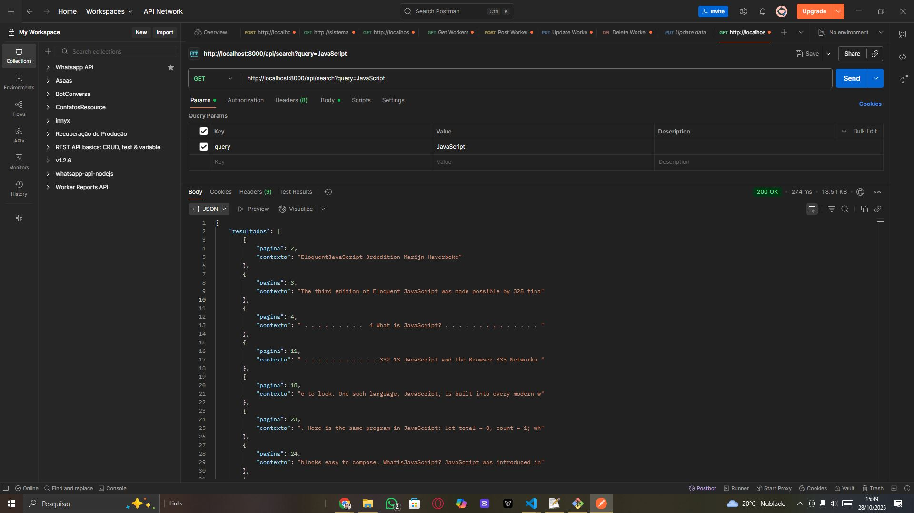

## Evidencia de pruebas

Se realizaron pruebas del endpoint de búsqueda utilizando Postman, confirmando que la API responde correctamente con los resultados esperados:

# Implementación técnica

A continuación se documentan los pasos y decisiones tomadas durante la implementación de la funcionalidad de búsqueda en el proyecto "search-inside-a-book".

## Avances realizados (28/10/2025)

- Se creó el controlador `SearchController` con el método `search`, encargado de leer el archivo JSON del libro, filtrar las páginas por el término buscado y devolver los resultados en formato JSON.
- Se añadió la ruta de API `GET /api/search` en `routes/api.php`, apuntando al método `search` del controlador.
- Se implementó la lógica de búsqueda, extrayendo fragmentos de contexto relevantes y asegurando la codificación UTF-8 en las respuestas.
- Se realizaron pruebas exhaustivas del endpoint `/api/search?query=JavaScript`, resolviendo problemas de codificación y garantizando que la API responde correctamente con resultados esperados.
- Se documentó el proceso de limpieza y validación del archivo JSON para evitar errores de UTF-8.

## Implementação da API de Busca e Página Completa

## Passos realizados

- Corrigido problema de autoload do Laravel: o arquivo `SearchController.php` estava sem a tag de abertura `<?php`, impedindo o reconhecimento da classe pelo Composer. Após adicionar a tag, o endpoint `/api/page/{numero}` passou a funcionar normalmente.
- Testado endpoint `/api/page/2` via Postman, retornando corretamente o conteúdo da página.
- Testado endpoint `/api/search?query=palavra`, retornando resultados (ou vazio, conforme o termo).

## Próximos passos

- [ ] Melhorar documentação dos endpoints e exemplos de uso.
- [ ] Adicionar testes automatizados para os endpoints.
- [ ] (Opcional) Implementar paginação ou filtros avançados na busca.

## Observações

- Atenção: sempre garantir que todos os arquivos PHP tenham a tag de abertura `<?php` para evitar problemas de autoload no Laravel.
- O JSON de dados deve estar limpo e codificado em UTF-8.

# Resumo dos Itens 1 e 2 do Planejamento

## 1. Leitura de Requisitos (README.md)
- **Objetivo:** Implementar uma busca dentro de um livro, exibindo trechos e informações sobre onde a correspondência foi encontrada.
- O usuário pode visualizar a página completa ao selecionar um resultado.
- O arquivo `Eloquent_JavaScript.json` (em `storage/exercise-files/`) contém o texto do livro, página por página.
- O exercício permite foco em backend, frontend, mobile ou abordagem combinada.
- **Documentação:** Decisões, trade-offs, limitações e plano de evolução devem ser registrados.
- **Entrega:** Via Merge Request, funcionando localmente, com instruções claras de execução e testes.

## 2. Configuração do Ambiente
- **Stack:** Laravel 12, PHP 8.3+, Docker, Sail, PostgreSQL, Vite.
- **Passos principais:**
  1. Clonar o fork do repositório.
  2. Copiar `.env.example` para `.env`.
  3. Rodar `composer install`.
  4. Subir o ambiente com `./vendor/bin/sail up -d`.
  5. Gerar a chave da aplicação.
  6. Instalar dependências JS com `./vendor/bin/sail yarn install`.
  7. Rodar `./vendor/bin/sail yarn dev` para desenvolvimento.
  8. Rodar migrations se necessário.
  9. Criar o symlink de storage se for usar arquivos.
  10. Acessar a aplicação em http://localhost:8888.

## Etapa: Implementação da visualização de página completa

- Implementado endpoint `/api/page/{numero}` no backend Laravel, permitindo ao usuário visualizar o conteúdo completo de uma página do livro.
- Corrigido problema de autoload do controller (ausência da tag `<?php` no início do arquivo).
- Testado com sucesso via Postman e curl, retornando corretamente o conteúdo da página solicitada.
- Documentado o fluxo de busca e visualização de página:
  1. Usuário realiza busca por termo usando `/api/search?query=...`.
  2. Recebe lista de resultados com trechos e número da página.
  3. Pode acessar `/api/page/{numero}` para visualizar o texto completo da página.
- Próximos passos: documentar exemplos de uso, adicionar testes automatizados e subir para o GitLab.

---

## Etapa de paginación y visualización de página completa

- Se implementó el endpoint `/api/page/{numero}` en el backend (Laravel) para permitir la visualización del contenido completo de una página del libro.
- El controlador `SearchController` ahora incluye el método `pagina($numero)`, que busca la página solicitada en el archivo JSON y retorna su contenido en formato JSON.
- Se corrigió un problema de autoload (falta de la etiqueta `<?php` en el archivo del controlador), lo que impedía que Laravel reconociera la clase.
- Se probó el endpoint con Postman y curl, confirmando que retorna correctamente el contenido de la página solicitada.
- Esta funcionalidad permite que, tras una búsqueda, el usuario pueda consultar el texto completo de cualquier página encontrada.

---

*Próximos passos: detalhar as decisões técnicas, trade-offs e plano de evolução do projeto.*
