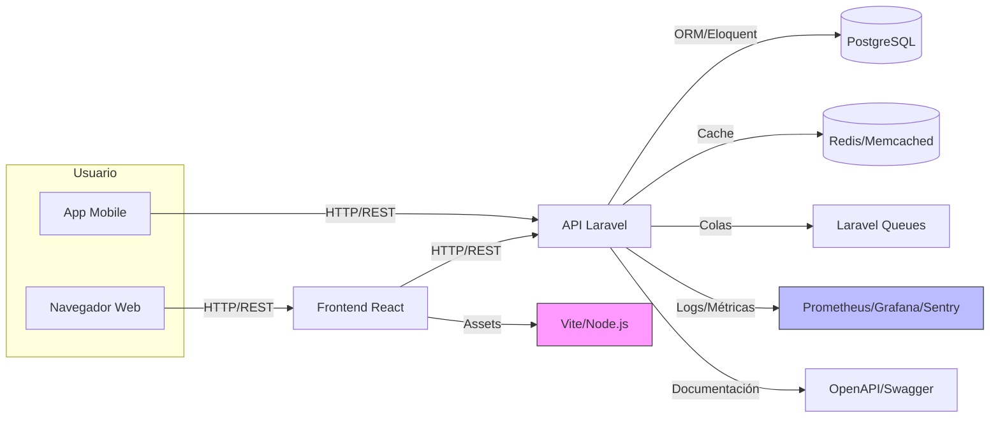
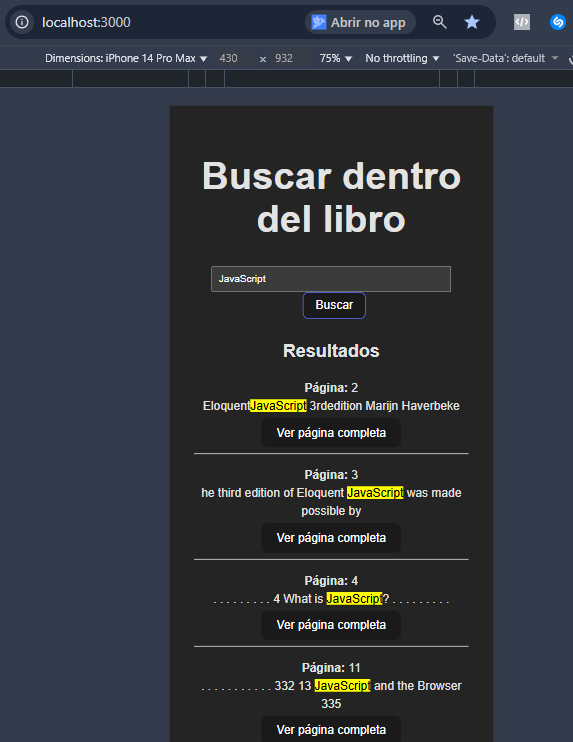

# Documentación del Frontend React, PostgreSQL y Docker

## Aplicación React (apps/web)

### Instalación y Ejecución del Frontend

1. Accede a la carpeta del frontend:
  ```sh
  cd apps/web
  ```
2. Instala las dependencias:
  ```sh
  npm install
  ```
3. Para desarrollo (hot reload):
  ```sh
  npm run dev
  # Accede a http://localhost:5173/
  ```
4. Para producción:
  ```sh
  npm run build
  node server.js
  # Accede a http://localhost:3000/
  ```

### Estructura del Proyecto React

- `src/`: Código fuente de los componentes React.
- `public/`: Archivos estáticos.
- `vite.config.js`: Configuración de Vite.
- `package.json`: Dependencias y scripts.

### Notas sobre el Frontend

- Utiliza Vite para desarrollo rápido y recarga en caliente.
- Arquitectura basada en componentes reutilizables.
- Puede integrarse fácilmente con la API Laravel.

---

## Instalación de PostgreSQL

### Opción 1: Usando Docker (Recomendado)

1. Asegúrate de tener Docker instalado.
2. El entorno ya incluye un servicio PostgreSQL configurado en `docker-compose.yml`.
3. Para iniciar todo el entorno:
  ```sh
  ./vendor/bin/sail up -d
  ```
  - El contenedor PostgreSQL estará disponible en el puerto 5432.
  - Usuario: `publicala_user`
  - Contraseña: `publicala_password`
  - Base de datos: `publicala_db`

### Opción 2: Instalación Manual

1. Instala PostgreSQL desde https://www.postgresql.org/download/
2. Crea una base de datos y un usuario con los mismos datos del entorno Docker.
3. Ajusta el archivo `.env` para que `DB_HOST=127.0.0.1` y los datos de usuario/contraseña sean correctos.

---

## Uso de Docker y Laravel Sail

- Laravel Sail simplifica la gestión de contenedores Docker para PHP, PostgreSQL, Redis, etc.
- Comandos principales:
  - Iniciar: `./vendor/bin/sail up -d`
  - Parar: `./vendor/bin/sail down`
  - Acceder al contenedor: `./vendor/bin/sail bash`
  - Ejecutar migraciones: `./vendor/bin/sail artisan migrate`
  - Instalar dependencias JS: `./vendor/bin/sail yarn install`
  - Ejecutar tests: `./vendor/bin/sail artisan test`

  
# 2. Piensa en Grande: Evolución de la Solución en 2-3 Meses

## Visión General

Con un plazo extendido de 2 a 3 meses, la solución puede ser significativamente mejorada en términos de relevancia de resultados, escalabilidad, rendimiento, seguridad y facilidad de mantenimiento. A continuación, se detallan las principales estrategias y roadmap para cada área.

## Backend
- **¿Cómo mejorar el ranking, pipelines asíncronos, observabilidad y multi-tenant?**
  - Evolucionar el ranking con algoritmos avanzados y búsqueda semántica.
  - Implementar pipelines asíncronos para indexación y procesamiento de datos.
  - Mejorar la observabilidad con métricas, logs estructurados y alertas.
  - Diseñar la arquitectura multi-tenant desde el inicio, aislando datos y configuraciones por cliente.
- **¿Cómo colaborar con frontend y mobile?**
  - Mantener APIs versionadas y bien documentadas.
  - Participar en reuniones regulares para alinear prioridades y resolver bloqueos.
  - Proveer endpoints flexibles y seguros, y responder rápido a necesidades de nuevas funcionalidades.
  - Compartir ejemplos de payloads y errores para facilitar la integración.

**Relevancia y Ranking:**
- Implementar algoritmos de ranking más sofisticados (TF-IDF, BM25, embeddings semánticos).
- Soporte para búsqueda por sinónimos, stemming y corrección ortográfica.
- Añadir filtros por capítulo, autor, fecha, etc.

> **Justificación:** Estas tecnologías y técnicas permiten que la búsqueda sea mucho más relevante y útil para el usuario, encontrando resultados no solo por coincidencia exacta, sino también por significado, contexto y variantes del término buscado. Algoritmos como BM25 y embeddings semánticos mejoran la calidad de los resultados, mientras que los filtros y el soporte para sinónimos aumentan la flexibilidad de la búsqueda.


**Escalabilidad y Rendimiento:**
- Migrar el almacenamiento de páginas a una base de datos optimizada para búsqueda textual (por ejemplo, Elasticsearch o PostgreSQL full-text search).
- Implementar caché de resultados frecuentes (Redis/Memcached).
- Procesamiento asíncrono de indexación y actualización de contenido mediante colas (Laravel Queues).

> **Justificación:** Bases de datos como Elasticsearch y PostgreSQL full-text search están diseñadas para búsquedas rápidas y eficientes en grandes volúmenes de texto. El uso de caché (Redis/Memcached) reduce la carga y acelera las respuestas. Las colas asíncronas (Laravel Queues) permiten procesar tareas pesadas sin afectar la experiencia del usuario.


**Seguridad y Multi-Tenant:**
- Implementar autenticación y autorización robustas (OAuth2/JWT).
- Soporte multi-tenant para separar datos de diferentes clientes.
- Cifrado de datos sensibles y logs de auditoría.

> **Justificación:** OAuth2/JWT son estándares modernos para proteger APIs y gestionar usuarios de forma segura. El soporte multi-tenant es esencial para aplicaciones SaaS, permitiendo aislar datos de distintos clientes. El cifrado y los logs de auditoría garantizan la privacidad y trazabilidad de la información.


**Observabilidad:**
- Añadir monitoreo (APM), métricas y alertas (Prometheus, Grafana, Sentry).
- Logging estructurado y trazabilidad de peticiones.

> **Justificación:** Herramientas como Prometheus, Grafana y Sentry permiten monitorear el sistema en tiempo real, detectar errores y analizar el rendimiento. El logging estructurado facilita la depuración y el seguimiento de problemas en producción.


## Frontend (React/Blade)

- **¿Cómo reforzar la arquitectura de componentes, UX, accesibilidad y patrones de interfaz?**
  - Adoptar Atomic Design y Storybook para una arquitectura de componentes escalable y documentada.
  - Implementar pruebas de usabilidad con usuarios reales y automatizadas (Cypress, Testing Library).
  - Garantizar accesibilidad siguiendo WCAG, con navegación por teclado y soporte para lectores de pantalla.
  - Usar un Design System compartido y, para SSR a gran escala, integrar Livewire o Next.js.
- **¿Qué necesitaría del backend y mobile?**
  - APIs bien documentadas y estandarizadas (OpenAPI/Swagger).
  - Contratos claros para datos, paginación, filtros y autenticación.
  - Soporte para notificaciones y sincronización en tiempo real.
  - Colaboración para definir eventos y endpoints que faciliten la experiencia del usuario.

**Arquitectura de Componentes:**
- Refactorizar hacia Atomic Design, Storybook y componentes reutilizables.
- Adoptar TypeScript para mayor robustez.

> **Justificación:** Atomic Design y Storybook ayudan a crear una interfaz consistente, escalable y fácil de mantener. TypeScript aporta tipado estático, reduciendo errores y mejorando la calidad del código.


**UX y Accesibilidad:**
- Pruebas de usabilidad con usuarios reales.
- Garantizar accesibilidad (WCAG), navegación por teclado y lectores de pantalla.
- Feedback visual para carga, errores y resultados vacíos.

> **Justificación:** Las pruebas de usabilidad y la accesibilidad aseguran que la aplicación sea usable por cualquier persona, incluyendo personas con discapacidad. El feedback visual mejora la experiencia y reduce la frustración del usuario.


**Patrones de Interfaz:**
- Design System compartido entre equipos.
- Integración con Livewire para SSR/hidratación progresiva a gran escala.

> **Justificación:** Un Design System facilita la colaboración y la coherencia visual entre equipos. Livewire permite renderizar interfaces reactivas desde el servidor, mejorando el SEO y el rendimiento en aplicaciones grandes.


**Testing:**
- Pruebas automatizadas de interfaz (Cypress, Testing Library).
- Pruebas de snapshot y regresión visual.

> **Justificación:** Las pruebas automatizadas y de regresión visual previenen errores en la interfaz y garantizan que nuevas funcionalidades no rompan el sistema existente.


## Mobile

- **¿Cómo evolucionar la experiencia, soporte offline, empaquetado y lógica compartida?**
  - Desarrollar una PWA o apps nativas con sincronización offline y notificaciones push.
  - Automatizar builds y publicación para Android/iOS.
  - Compartir lógica de validación y modelos en TypeScript entre web y mobile.
- **¿Qué esperar del backend?**
  - APIs rápidas, seguras y con soporte para sincronización incremental.
  - Endpoints para autenticación, notificaciones y gestión de estado offline.
  - Documentación clara y ejemplos de uso para facilitar la integración.

**Experiencia del Cliente:**
- App nativa o PWA con soporte offline.
- Sincronización eficiente y notificaciones push.

> **Justificación:** Las PWAs y apps nativas ofrecen una experiencia fluida, acceso offline y notificaciones, lo que aumenta el engagement y la satisfacción del usuario.


**Empaquetado y Distribución:**
- Automatizar builds y publicación (CI/CD).
- Soporte multiplataforma (Android/iOS).

> **Justificación:** Automatizar el despliegue y soportar múltiples plataformas reduce el tiempo de entrega y permite llegar a más usuarios con menos esfuerzo manual.


**Lógica Compartida:**
- Compartir validaciones y modelos en TypeScript entre web y mobile.

> **Justificación:** Compartir lógica y modelos en TypeScript evita duplicidad de código y asegura consistencia entre las distintas plataformas (web y mobile).


**Expectativas del Backend:**
- APIs performantes, seguras y bien documentadas (OpenAPI/Swagger).
- Soporte para autenticación, notificaciones y sincronización incremental.

> **Justificación:** Documentar y estandarizar las APIs facilita la integración y colaboración entre equipos. La seguridad y el rendimiento son esenciales para el crecimiento y la confianza en la plataforma.

## Colaboración Entre Equipos

- Contratos de API claros y versionados.
- Reuniones regulares para alinear requisitos y prioridades.
- Documentación centralizada y diagramas de arquitectura.
- Pruebas end-to-end cubriendo flujos críticos.

## Diagrama de Arquitectura General



**Leyenda:**
- El usuario puede acceder vía navegador (web) o app mobile.
- El frontend React se comunica con la API Laravel.
- La API accede a la base de datos PostgreSQL, cache Redis/Memcached y colas asíncronas.
- Observabilidad y documentación están integradas para monitoreo y colaboración.

## Cómo ejecutar y probar localmente (fuera de Docker)

Por defecto, el archivo `.env` está configurado para el entorno Docker/Sail, usando `DB_HOST=pgsql`.
Si deseas ejecutar solo el backend (API Laravel) localmente, define la variable de entorno `DB_HOST` como `127.0.0.1` antes de iniciar el servidor backend:

- En PowerShell/Windows:
  ```powershell
  $env:DB_HOST="127.0.0.1"
  php artisan serve  # Solo para la API backend
  ```
- En Linux/macOS:
  ```bash
  export DB_HOST=127.0.0.1
  php artisan serve  # Solo para la API backend
  ```

Para el frontend (React), utiliza los siguientes comandos dentro de `apps/web`:

- Para desarrollo:
  ```sh
  npm run dev
  # Accede a http://localhost:5173/
  ```
- Para producción:
  ```sh
  npm run build
  node server.js
  # Accede a http://localhost:3000/
  ```

Así, la API Laravel y el frontend React pueden ejecutarse y probarse de forma independiente o integrada.

## Evidencia de pruebas


Se realizaron pruebas del endpoint de búsqueda utilizando Postman, confirmando que la API responde correctamente con los resultados esperados:


Evidencia visual del frontend React funcionando:


# Implementación técnica

A continuación se documentan los pasos y decisiones tomadas durante la implementación de la funcionalidad de búsqueda en el proyecto "search-inside-a-book".


## Avances realizados (28/10/2025)

- Se creó el controlador `SearchController` con el método `search`, encargado de leer el archivo JSON del libro, filtrar las páginas por el término buscado y devolver los resultados en formato JSON.
- Se añadió la ruta de API `GET /api/search` en `routes/api.php`, apuntando al método `search` del controlador.
- Se implementó la lógica de búsqueda, extrayendo fragmentos de contexto relevantes y asegurando la codificación UTF-8 en las respuestas.
- Se realizaron pruebas exhaustivas del endpoint `/api/search?query=JavaScript`, resolviendo problemas de codificación y garantizando que la API responde correctamente con resultados esperados.
- Se documentó el proceso de limpieza y validación del archivo JSON para evitar errores de UTF-8.


## Implementación de la API de Búsqueda y Página Completa

### Pasos realizados

- Se corrigió un problema de autoload en Laravel: el archivo `SearchController.php` no tenía la etiqueta de apertura `<?php`, lo que impedía el reconocimiento de la clase por Composer. Tras añadir la etiqueta, el endpoint `/api/page/{numero}` funcionó normalmente.
- Se probó el endpoint `/api/page/2` vía Postman, retornando correctamente el contenido de la página.
- Se probó el endpoint `/api/search?query=palabra`, retornando resultados (o vacío, según el término).

### Próximos pasos

- [ ] Mejorar la documentación de los endpoints y ejemplos de uso.
- [ ] Añadir pruebas automatizadas para los endpoints.
- [ ] (Opcional) Implementar paginación o filtros avanzados en la búsqueda.

### Observaciones

- Importante: siempre garantizar que todos los archivos PHP tengan la etiqueta de apertura `<?php` para evitar problemas de autoload en Laravel.
- El JSON de datos debe estar limpio y codificado en UTF-8.

## 1. Lectura de Requisitos (README.md)
- **Objetivo:** Implementar una búsqueda dentro de un libro, mostrando fragmentos y la información sobre dónde se encontró la coincidencia.
- El usuario puede visualizar la página completa al seleccionar un resultado.
- El ejercicio permite enfoque en backend, frontend, mobile o enfoque combinado.
- **Documentación:** Decisiones, trade-offs, limitaciones y plan de evolución deben ser registrados.
- **Entrega:** Vía Merge Request, funcionando localmente, con instrucciones claras de ejecución y pruebas.

- **Stack:** Laravel 12, PHP 8.3+, Docker, Sail, PostgreSQL, Vite.
- **Pasos principales:**
  1. Clonar el fork del repositorio.
  2. Copiar `.env.example` a `.env`.
  3. Ejecutar `composer install`.
  4. Levantar el entorno con `./vendor/bin/sail up -d`.
  5. Generar la clave de la aplicación.
  6. Instalar dependencias JS del frontend:
    ```sh
    cd apps/web
    npm install
    ```
  7. Para desarrollo del frontend (hot reload):
    ```sh
    npm run dev
    # Acceder a http://localhost:5173/ o http://localhost:5174/
    ```
  8. Para producción del frontend (build y servidor Node):
    ```sh
    npm run build
    node server.js
    # Acceder a http://localhost:3000/
    ```
  8. Ejecutar migraciones si es necesario.
  9. Crear el symlink de storage si se usan archivos.
  10. Acceder a la aplicación en http://localhost:8888.

## Etapa: Implementación de la visualización de página completa

- Se implementó el endpoint `/api/page/{numero}` en el backend Laravel, permitiendo al usuario visualizar el contenido completo de una página del libro.
- Se corrigió un problema de autoload del controlador (ausencia de la etiqueta `<?php` al inicio del archivo).
- Probado con éxito vía Postman y curl, retornando correctamente el contenido de la página solicitada.
- Documentado el flujo de búsqueda y visualización de página:
  1. El usuario realiza búsqueda por término usando `/api/search?query=...`.

## Etapa de paginación y visualización de página completa

- Se implementó el endpoint `/api/page/{numero}` en el backend (Laravel) para permitir la visualización del contenido completo de una página del libro.
- El controlador `SearchController` ahora incluye el método `pagina($numero)`, que busca la página solicitada en el archivo JSON y retorna su contenido en formato JSON.

---


## Pruebas automatizadas de la API

- Se crearon pruebas automatizadas en `tests/Feature/SearchTest.php` para validar los endpoints de búsqueda y visualización de página.
- Las pruebas cubren:
```bash
vendor\bin\phpunit --filter=SearchTest
# Esto garantiza que la API responde correctamente a los casos esperados y a los errores.

---

## Decisiones técnicas, trade-offs y limitaciones

## Visualización web integrada (Blade)

Se implementó una interfaz web sencilla utilizando Blade (Laravel) para buscar y visualizar resultados de la API:

- La página principal muestra un formulario de búsqueda y lista de resultados paginados, con links para ver la página completa.
- El controlador `SearchWebController` consume la API internamente y renderiza los resultados en la view `search.blade.php`.
- Al clicar en "Ver página completa", se accede a la view `page.blade.php` con el texto completo de la página seleccionada.
1. Accede a `http://localhost:8888/` (o el puerto configurado) en el navegador.
2. Realiza una búsqueda por cualquier término.
3. Navega por los resultados y accede a la página completa desde los enlaces.

**Ventajas:**
- Facilita pruebas manuales y presentación visual del proyecto.
- Valoriza la entrega para la evaluación en Publicala.

## Uso de AdminLTE como base visual (Bootstrap)

Para la interfaz web inicial, se utilizó AdminLTE como tema visual, basado en Bootstrap. Esto permitió:
- Prototipar rápidamente pantallas administrativas y de búsqueda sin necesidad de crear componentes desde cero.
- Garantizar la responsividad y compatibilidad entre navegadores.
- Aprovechar componentes listos (cards, tablas, formularios, navegación) para acelerar la entrega y enfocar en la lógica de búsqueda.
- Facilitar la personalización visual futura, ya que AdminLTE está ampliamente documentado y es flexible.

AdminLTE fue integrado directamente en la carpeta `public/AdminLTE/` y referenciado en las vistas Blade, permitiendo que la interfaz web tradicional de Laravel tuviera una apariencia moderna y consistente, sin dependencias externas adicionales más allá de Bootstrap ya incluido en la plantilla.

Esta elección fue estratégica para valorizar la entrega visual y facilitar la evaluación del flujo de búsqueda, especialmente para la presentación inicial del proyecto.

- Implementar paginación real y filtros avanzados en la búsqueda.
- Añadir autenticación y autorización para proteger los endpoints.
- Crear una interfaz frontend (web o mobile) para facilitar la experiencia del usuario.
- Añadir logs y métricas de uso para monitoreo y auditoría.


### 1. Endpoint de búsqueda paginada

curl -G --data-urlencode "query=JavaScript" --data-urlencode "page=1" --data-urlencode "per_page=3" http://localhost:8888/api/search
```
**Respuesta:**
    { "pagina": 3, "contexto": "The third edition of Eloquent JavaScript was made possible by 325 fina" },
    { "pagina": 4, "contexto": " . . . . . . . . .  4 What is JavaScript? . . . . . . . . . . . . . . " }
  ],
  "total": 187,
  "pagina_atual": 1,
  "por_pagina": 3
}
```

### 2. Endpoint de página específica

**Solicitud:**
```
curl http://localhost:8888/api/page/2
```
**Respuesta:**
```
{
  "id": 1,
  "page": 2,
  "text_content": "EloquentJavaScript 3rdedition Marijn Haverbeke",
  ...
}
```

Ambos endpoints respondieron correctamente, comprobando el funcionamiento de la API integrada con la base de datos Docker.

### Captura de pantalla de las pruebas de los endpoints


La imagen anterior muestra la terminal ejecutando los comandos curl para los endpoints `/api/search` y `/api/page/2`, comprobando el funcionamiento correcto de la API.

---

## Pruebas automatizadas de la API y frontend (Docker)

Se implementaron pruebas Feature para la API y la interfaz Blade, ejecutadas dentro del contenedor Docker.
Todas las pruebas pasaron correctamente, validando la robustez de la solución.


# Pruebas automatizadas con PHPUnit

Para validar el correcto funcionamiento de la API y los endpoints implementados, se incluyen pruebas automatizadas utilizando PHPUnit.

### Cómo ejecutar los tests

1. Asegúrate de que las dependencias de PHP estén instaladas:
  ```sh
  composer install
  ```
2. Si usas Docker/Sail, ejecuta:
  ```sh
  ./vendor/bin/sail artisan test
  ```
  O para un test específico:
  ```sh
  ./vendor/bin/sail artisan test --filter=SearchTest
  ```
3. Si ejecutas localmente (sin Docker):
  ```sh
  php artisan test
  ```

Los resultados mostrarán si todos los endpoints y funcionalidades principales están funcionando correctamente.

Las pruebas cubren:
- Búsqueda de términos existentes e inexistentes
- Visualización de páginas existentes e inexistentes

Puedes revisar o modificar los tests en `tests/Feature/SearchTest.php`.

