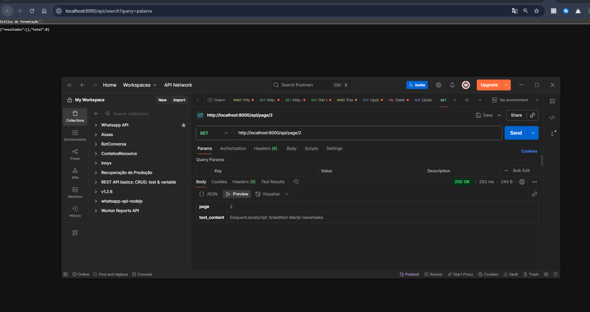
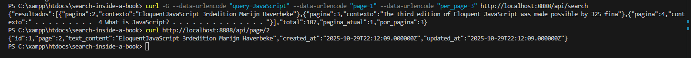

## Cómo ejecutar y probar localmente (fuera de Docker)

Por defecto, el archivo `.env` está configurado para el entorno Docker/Sail, usando `DB_HOST=pgsql`.
Para ejecutar y probar localmente (usando `php artisan serve`), defina la variable de entorno `DB_HOST` como `127.0.0.1` antes de iniciar el servidor:

- En PowerShell/Windows:
  ```powershell
  $env:DB_HOST="127.0.0.1"
  php artisan serve
  ```
- En Linux/macOS:
  ```bash
  export DB_HOST=127.0.0.1
  php artisan serve
  ```

Así, la aplicación podrá conectarse al PostgreSQL local normalmente.

## Evidencia de pruebas

Se realizaron pruebas del endpoint de búsqueda utilizando Postman, confirmando que la API responde correctamente con los resultados esperados:


# Implementación técnica

A continuación se documentan los pasos y decisiones tomadas durante la implementación de la funcionalidad de búsqueda en el proyecto "search-inside-a-book".


## Avances realizados (28/10/2025)

- Se creó el controlador `SearchController` con el método `search`, encargado de leer el archivo JSON del libro, filtrar las páginas por el término buscado y devolver los resultados en formato JSON.
- Se añadió la ruta de API `GET /api/search` en `routes/api.php`, apuntando al método `search` del controlador.
- Se implementó la lógica de búsqueda, extrayendo fragmentos de contexto relevantes y asegurando la codificación UTF-8 en las respuestas.
- Se realizaron pruebas exhaustivas del endpoint `/api/search?query=JavaScript`, resolviendo problemas de codificación y garantizando que la API responde correctamente con resultados esperados.
- Se documentó el proceso de limpieza y validación del archivo JSON para evitar errores de UTF-8.

## Implementação da API de Busca e Página Completa

## Passos realizados

- Corrigido problema de autoload do Laravel: o arquivo `SearchController.php` estava sem a tag de abertura `<?php`, impedindo o reconhecimento da classe pelo Composer. Após adicionar a tag, o endpoint `/api/page/{numero}` passou a funcionar normalmente.
- Testado endpoint `/api/page/2` via Postman, retornando corretamente o conteúdo da página.
- Testado endpoint `/api/search?query=palavra`, retornando resultados (ou vazio, conforme o termo).

## Próximos passos

- [ ] Melhorar documentação dos endpoints e exemplos de uso.
- [ ] Adicionar testes automatizados para os endpoints.
- [ ] (Opcional) Implementar paginação ou filtros avançados na busca.

## Observações

- Atenção: sempre garantir que todos os arquivos PHP tenham a tag de abertura `<?php` para evitar problemas de autoload no Laravel.
- O JSON de dados deve estar limpo e codificado em UTF-8.


## 1. Leitura de Requisitos (README.md)
- **Objetivo:** Implementar uma busca dentro de um livro, exibindo trechos e informações sobre onde a correspondência foi encontrada.
- O usuário pode visualizar a página completa ao selecionar um resultado.
- O exercício permite foco em backend, frontend, mobile ou abordagem combinada.
- **Documentação:** Decisões, trade-offs, limitações e plano de evolução devem ser registrados.
- **Entrega:** Via Merge Request, funcionando localmente, com instruções claras de execução e testes.

- **Stack:** Laravel 12, PHP 8.3+, Docker, Sail, PostgreSQL, Vite.
- **Passos principais:**
  1. Clonar o fork do repositório.
  2. Copiar `.env.example` para `.env`.
  3. Rodar `composer install`.
  4. Subir o ambiente com `./vendor/bin/sail up -d`.
  5. Gerar a chave da aplicação.
  6. Instalar dependências JS com `./vendor/bin/sail yarn install`.
  7. Rodar `./vendor/bin/sail yarn dev` para desenvolvimento.
  8. Rodar migrations se necessário.
  9. Criar o symlink de storage se for usar arquivos.
  10. Acessar a aplicação em http://localhost:8888.

## Etapa: Implementação da visualização de página completa

- Implementado endpoint `/api/page/{numero}` no backend Laravel, permitindo ao usuário visualizar o conteúdo completo de uma página do livro.
- Corrigido problema de autoload do controller (ausência da tag `<?php` no início do arquivo).
- Testado com sucesso via Postman e curl, retornando corretamente o conteúdo da página solicitada.
- Documentado o fluxo de busca e visualização de página:
  1. Usuário realiza busca por termo usando `/api/search?query=...`.

## Etapa de paginación y visualización de página completa

- Se implementó el endpoint `/api/page/{numero}` en el backend (Laravel) para permitir la visualización del contenido completo de una página del libro.
- El controlador `SearchController` ahora incluye el método `pagina($numero)`, que busca la página solicitada en el archivo JSON y retorna su contenido en formato JSON.

---




## Pruebas automatizadas de la API

- Se crearon pruebas automatizadas en `tests/Feature/SearchTest.php` para validar los endpoints de búsqueda y visualización de página.
- Las pruebas cubren:
```bash
vendor\bin\phpunit --filter=SearchTest
- Isso garante que a API responde corretamente aos casos esperados e aos erros.

---

## Decisiones técnicas, trade-offs y limitaciones

## Visualización web integrada (Blade)

Se implementó una interfaz web sencilla utilizando Blade (Laravel) para buscar y visualizar resultados de la API:

- La página principal muestra un formulario de búsqueda y lista de resultados paginados, con links para ver la página completa.
- El controlador `SearchWebController` consume la API internamente y renderiza los resultados en la view `search.blade.php`.
- Al clicar en "Ver página completa", se accede a la view `page.blade.php` con el texto completo de la página seleccionada.
1. Acceda a `http://localhost:8888/` (ou la porta configurada) en el navegador.
2. Realice una búsqueda por cualquier término.
3. Navegue por los resultados y acceda a la página completa desde los links.
**Ventajas:**
- Facilita pruebas manuales y presentación visual del proyecto.
- Valoriza la entrega para la evaluación en Publicala.

- Implementar paginação real e filtros avançados na busca.
- Adicionar autenticação e autorização para proteger os endpoints.
- Criar uma interface frontend (web ou mobile) para facilitar a experiência do usuário.
- Adicionar logs e métricas de uso para monitoramento e auditoria.


### 1. Endpoint de búsqueda paginada

curl -G --data-urlencode "query=JavaScript" --data-urlencode "page=1" --data-urlencode "per_page=3" http://localhost:8888/api/search
```
**Respuesta:**
    { "pagina": 3, "contexto": "The third edition of Eloquent JavaScript was made possible by 325 fina" },
    { "pagina": 4, "contexto": " . . . . . . . . .  4 What is JavaScript? . . . . . . . . . . . . . . " }
  ],
  "total": 187,
  "pagina_atual": 1,
  "por_pagina": 3
}
```

### 2. Endpoint de página específica

**Solicitud:**
```
curl http://localhost:8888/api/page/2
```
**Respuesta:**
```
{
  "id": 1,
  "page": 2,
  "text_content": "EloquentJavaScript 3rdedition Marijn Haverbeke",
  ...
}
```

Ambos endpoints respondieron correctamente, comprobando el funcionamiento de la API integrada con la base de datos Docker.

### Captura de pantalla de las pruebas de los endpoints



La imagen anterior muestra la terminal ejecutando los comandos curl para los endpoints `/api/search` y `/api/page/2`, comprobando el funcionamiento correcto de la API.

---
## Pruebas automatizadas de la API y frontend (Docker)

Se implementaron pruebas Feature para la API y la interfaz Blade, ejecutadas dentro del contenedor Docker.
Todas las pruebas pasaron correctamente, validando la robustez de la solución.

Evidencia de pruebas API:


Evidencia de pruebas frontend Blade:

