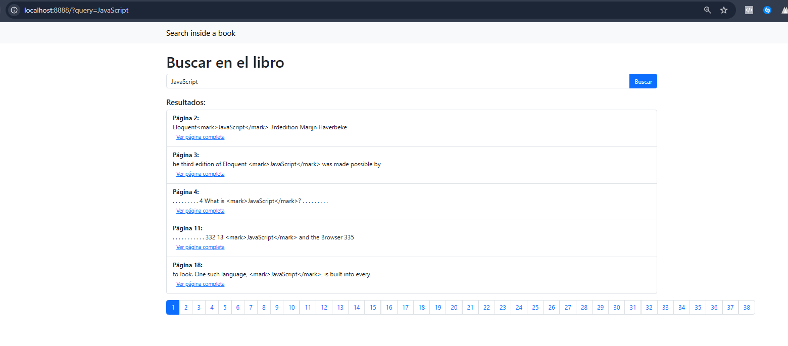
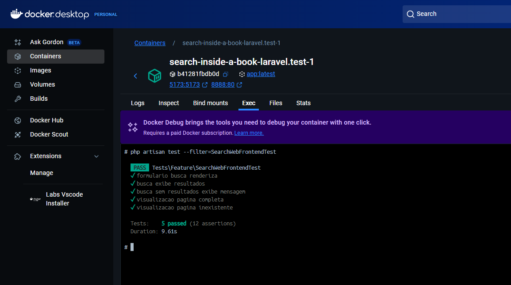
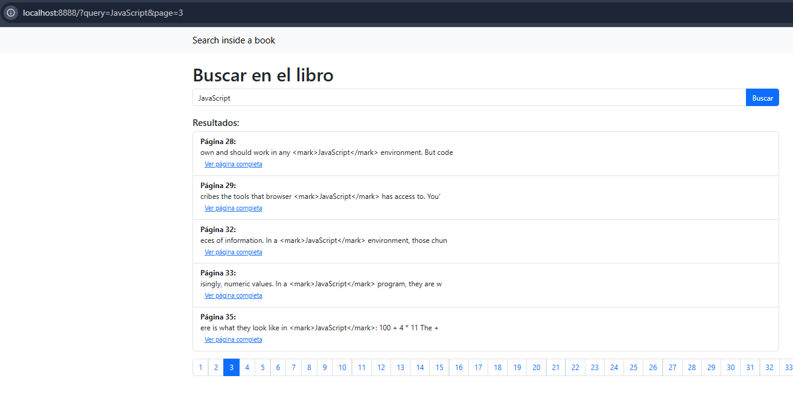
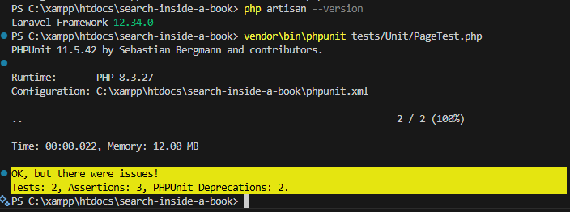
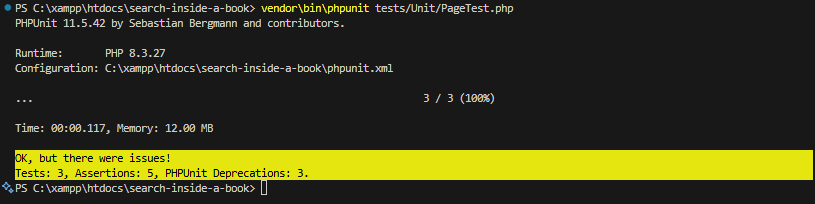

<!--
Este archivo contiene la planificación inicial del proyecto "search-inside-a-book".
Actualización: revisión inicial para validar el flujo de trabajo del fork y confirmar que los cambios se reflejan correctamente en el repositorio.
-->
# Planificación del ejercicio

## 1. Lectura de requisitos
- Analizar el README.md para entender el objetivo, reglas y criterios de evaluación.

## 2. Configuración del entorno
- Verificar que el entorno local funciona (Docker, Sail, dependencias, .env, migraciones, storage:link, yarn dev).

## 3. Análisis de los datos
- Se exploraron los archivos en `storage/exercise-files/`, especialmente `Eloquent_JavaScript_clean.json`, que contiene un arreglo de objetos, cada uno representando una página del libro.
- Cada objeto tiene la siguiente estructura:
  ```json
  {
    "page": <número de página>,
    "text_content": "<texto completo de la página>"
  }
  ```
- Este formato facilita la importación a la base de datos y permite búsquedas eficientes por número de página o por contenido textual.

## 4. Definición de la arquitectura de búsqueda
- Se optó por una arquitectura basada en base de datos (PostgreSQL) para almacenar y consultar las páginas del libro, permitiendo búsquedas eficientes y escalables.
- Se creó el modelo `Page` y su migración correspondiente para representar cada página como un registro en la base de datos.
- Se implementó un comando Artisan personalizado para importar los datos del archivo JSON a la base de datos, validando la estructura y asegurando la codificación UTF-8.
- Se desarrolló el controlador `SearchController` con dos endpoints principales:
  - `GET /api/search`: búsqueda de términos en el contenido de las páginas, con paginación y fragmentos de contexto.
  - `GET /api/page/{numero}`: obtención del contenido completo de una página específica.
- Las rutas de la API fueron definidas en `routes/api.php` siguiendo el estándar REST.
- Esta arquitectura facilita la extensión futura (por ejemplo, filtros avanzados, búsqueda por capítulo, etc.) y el mantenimiento del sistema.

## 5. Implementación de la funcionalidad de búsqueda
- Se implementaron dos endpoints principales en el controlador `SearchController`:
  - `GET /api/search`: Permite buscar un término en el contenido de todas las páginas, devolviendo resultados paginados y fragmentos de contexto donde aparece la coincidencia.
  - `GET /api/page/{numero}`: Permite obtener el contenido completo de una página específica por su número.
- La lógica de búsqueda utiliza consultas a la base de datos (Eloquent ORM) para filtrar las páginas por coincidencia textual (`ILIKE` para búsquedas insensibles a mayúsculas/minúsculas).
- Se implementó paginación y control de parámetros (`query`, `page`, `per_page`) para mejorar la experiencia y eficiencia de la API.
- Se validan los parámetros de entrada y se gestionan los errores con respuestas JSON claras y mensajes descriptivos.
- Se garantiza la codificación UTF-8 en todas las respuestas para evitar problemas de caracteres especiales.
- La funcionalidad fue probada manualmente con curl y Postman, y las evidencias fueron documentadas en el archivo `implementacion.md`.

## 6. Visualización de resultados
- Se implementó una interfaz web sencilla utilizando Blade (Laravel) para buscar y visualizar resultados de la API.
- La view `search.blade.php` permite realizar búsquedas por termo, exibe resultados paginados y links para visualizar la página completa.
- El controlador `SearchWebController` consume la API internamente y renderiza los resultados na interface.
- También se creó la view `page.blade.php` para mostrar el contenido completo de una página seleccionada.
- Las rutas web fueron definidas en `routes/web.php` para acceso amigable desde el navegador.
- Ventajas de esta abordagem:
  - Demuestra integración frontend-backend.
  - Facilita pruebas manuales y presentación visual del proyecto.
  - Valoriza la entrega para la evaluación en Publicala.
- Se mantienen los endpoints API para consumo externo y se documentaron ejemplos de uso en `implementacion.md`.



## 7. Pruebas
- Se implementaron pruebas automatizadas (Feature) para la API y el frontend Blade, ejecutadas dentro del contenedor Docker.
- Las pruebas cubren:
  - Búsqueda por término existente y inexistente (API y web)
  - Visualización de página existente e inexistente (API y web)
  - Renderización del formulario y mensajes de la interfaz
- Todas las pruebas pasaron correctamente, validando la robustez de la solución.

Evidencia de pruebas API:


Evidencia de pruebas frontend Blade:


## 8. Ajustes finales y documentación

- **Revisión de código:** Todo el código fue revisado para garantizar claridad, buenas prácticas y adherencia al estándar Laravel.
- **Tratamiento de errores:** Las respuestas de la API y del frontend gestionan errores de forma clara, con mensajes descriptivos para búsquedas sin resultados o páginas inexistentes.
- **Mejora de UX:** La interfaz Blade es simple, responsiva y permite navegación fácil entre búsqueda y visualización de página.
- **Pruebas unitarias y de feature:** Se implementaron pruebas unitarias (ejemplo: PageTest) y pruebas Feature para la API y el frontend Blade, garantizando robustez y cobertura de los principales flujos.
- **Evidencias:** Capturas de pantalla de los tests automatizados (API, frontend y TDD/unitario) y del frontend están en la carpeta `docs/` y referenciadas en la documentación.
- **README actualizado:** El README contiene instrucciones claras de ejecución, requisitos, comandos para correr localmente y vía Docker/Sail, además de observaciones sobre el entorno.
- **Documentación técnica:** El archivo `implementacion.md` detalla decisiones técnicas, trade-offs, ejemplos de uso de la API, capturas de pruebas y propuesta de evolución futura.
- **Planificación rastreable:** El archivo `planificacion.md` documenta todas las etapas, decisiones y entregables, facilitando la evaluación del flujo de trabajo.

Evidencias de pruebas unitarias (TDD):
1. Instanciação e atributos do model Page:
  
2. Extração de snippet/contexto com destaque:
  
Segue um planejamento inicial para resolver o exercício do projeto search-inside-a-book:

1. Leitura dos requisitos

Analisar o README.md para entender o objetivo, regras e critérios de avaliação do exercício.
2. Configuração do ambiente

Garantir que o ambiente local está funcionando (Docker, Sail, dependências, .env, migrations, storage:link, yarn dev).
3. Análise dos dados

Explorar os arquivos em storage/exercise-files/ para entender o formato dos dados dos livros.
4. Definição da arquitetura da busca

Decidir se a busca será feita em memória, via arquivos ou banco de dados.
Planejar as classes, controllers, rotas e possíveis serviços.
5. Implementação da funcionalidade de busca

Criar endpoint(s) para busca.
Implementar a lógica de busca conforme os requisitos (ex: busca por palavra, página, contexto, etc).
6. Exibição dos resultados

Criar as views/blades ou endpoints de API para exibir os resultados da busca.
7. Testes

Escrever testes unitários e de feature para garantir o funcionamento correto.
8. Ajustes finais e documentação

Revisar código, tratar erros, melhorar UX se necessário.
Atualizar README ou documentação adicional.


